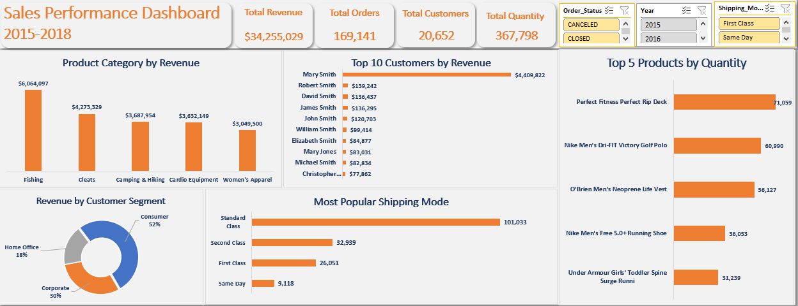
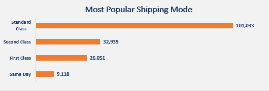
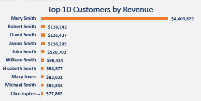
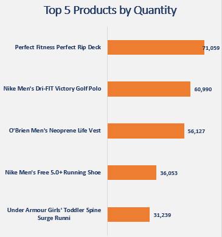
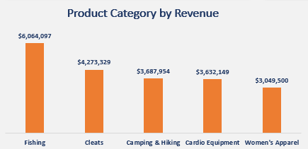
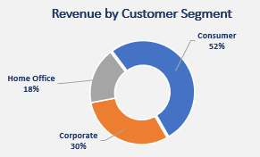

### Sales_Performance_Analysis
---
### Table of Contents
1. [Overview](#overview)  
2. [Project Objective](#project_objective)  
3. [Skills Demonstrated](#skills_demonstrated)  
4. [Data Source](#data_source)
5. [Tool](#tool)
6. [Findings](#findings)  
7. [Visualization](#visualization)  
8. [Recommendations](#recommendations)  

---
### Overview
This analysis presents the sales performance between 2015 to 2018, summarizing total revenue, total quantity sold, total customers, and total orders. It also provides insights into the most popular products, product category with the highest revenue, customer segment generating the highest revenue, most popular shipping mode and top 10 customers by revenue.  

---
### Project Objective  
The objective is to identify key performance indicators (KPIs) that drive sales growth and to pinpoint areas for improvement to optimize sales strategies. Understanding the variation in revenue and sales trends across different product category, customer segment, customers is critical for decision-making.   
I will be using the provided dataset to answer the following business questions;

1. Which shipping mode is the most common for our customers?
2. Who are our top 10 customers by revenue?
3. What are the top 5 that sold the most in terms of quantity?
4. What are the 5 categories of products that generated the most revenue?
5. Which customer segment contributed the most revenue?
6. What is the percentage of Cancelled Orders? Is it high and should it be of any concern?

---
### Skills Demonstrated 
- *Data Transformation:* Cleaning and Extracting information from 3 different worksheet using Xlookup and Vlookup
- *Data Analysis:* Extracting and interpreting key sales metrics using pivot table
- *Data Visualization:* Designing clear and interactive visuals to present trends and insights.  
- *Dashboard Creation:* Developing a functional and user-friendly sales dashboard.  

---
### Data Source  
This dataset was provided by the company’s account department. The features in the data set incudes sales between 2015 and 2018, segmented by year, customers, products, customer segment, shipping mode and revenue..

---
### Tool
- MicrosoftExcel 

---
### Findings

 **1. Total Revenue** 
A total revenue of **$34,255,029** was generated during this time(2015-2018). It is a vital KPI that indicates the financial performance of the company during this period. The high revenue suggests strong sales performance. However, breaking down this revenue by Customer, customer segment, product and product categories helps identify key contributors and areas for growth.

**2. Most Popular Shipping Mode**
For the 3years period we had a total order of **169,141**. From our analysis, the standard shipping mode is the most popular with **101,033** orders (60% of the total orders). This could be attributed to:  
-  its affordability and balance between cost and speed.
- Expedited shipping modes (e.g., Same-Day or First-Class) tend to be used less frequently due to higher costs.

**3. Top 10 Customers by Revenue** 
* Identifying the top 10 customers helps recognize high-value customers who drive a large share of revenue. From our analysis we had **20,652** customers; and our top buying customer Mary Smith contributed **13%** of our total revenue. 

**4. Top 5 Products by Quantity Sold** 
 In these 3years, product such as Perfect Fitness Perfect Rip Deck outperformed other products significantly in quantity sold. 
This product likely has high demand due to affordability, necessity, or effective promotions.
High-selling items may also indicate strong market fit or seasonal trends.

**5. Top 5 Product Categories by Revenue**  
The highest revenue was generated by the **Fishing equipment and cleats** product category. A high-revenue category may have higher margins, strong demand, or premium products.

**6. Customer Segment Contributing the Most Revenue**
The Consumer segment contributed the largest share of revenue **(52%)**. This may be because the business relies on many small transactions.  

**7. Percentage of Cancelled Orders & Concern Level**
The percentage of cancelled orders is **2%**. This is <5%, so it is within industry norms and may not be a major concern.

### Visualization  
This project contains one report page. 

**Most Popular Shipping Mode**

**Top 10 Customers by Revenue** 

**Top 5 Products by Quantity Sold**

**Top 5 Product Categories by Revenue**

**Customer Segment Contributing the Most Revenue**

---
### Recommendations

**1. Most Popular Shipping Mode** 
Explore why customers prefer Standard class and assess if cost optimisation opportunities exist without sacrificing service quality.
We could consider negotiating bulk shipping rates with logistics partners to reduce costs.

**2. Top 10 Customers by Revenue** 
We could offer loyalty incentives to retain top customers, such as discounts, early access to new products, or dedicated account managers.
Analyse their purchasing behaviour to tailor marketing strategies and introduce relevant cross-selling opportunities.

 **3. Top 5 Products by Quantity Sold** 
 Ensure sufficient inventory levels for top-selling products to prevent stockouts.
 Analyse demand patterns (e.g., peak seasons) to optimize procurement and avoid overstocking.
 Consider bundling popular products with complementary items to increase overall sales.

**4. Top 5 Product Categories by Revenue**  
 Invest in marketing campaigns for these high-performing categories to further boost sales.
 Optimize pricing strategies—if margins are high, consider discounts to increase sales further.
  Identify cross-selling opportunities—promote related products to maximize revenue per transaction.

**5. Customer Segment Contributing the Most Revenue** 
Tailor marketing efforts to the consumer segment with personalized promotions.
Expand service offerings for the consumer segment (e.g., volume discounts for businesses, membership perks for consumers).
Analyse barriers for the home office segment—is it pricing, awareness, or lack of targeted promotions?

**6. Percentage of Cancelled Orders & Concern Level**  
Investigate reasons for cancellations—track customer complaints, stock availability, and delivery delays.
Improve communication—send proactive updates about order status and delays.
Streamline the return/cancellation process—if orders are frequently cancelled due to long delivery times, consider working with alternative logistics providers.

